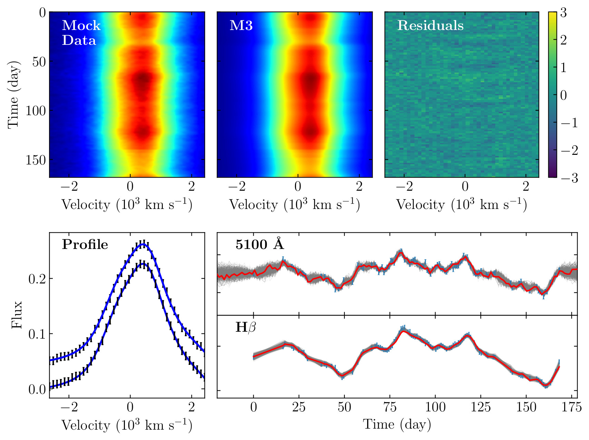

.. _getting_started:

***************
Getting started
***************

Third-party package dependence
===============================

  * **MPICH** --- an MPI implementation library, available at http://www-unix.mcs.anl.gov/mpi/mpich

  * **GSL** --- the GNU Scientific Library, downloaded at http://www.gnu.org/software/gs

  * **LAPACKE** --- the C-interface of LAPACK, downloaded at http://www.netlib.org/lapack/

  * **CDNest** --- Diffusive nested sampling, downloaded at https://github.com/LiyrAstroph/CDNest

Note that in Linux system, there are package managers that can install the above libraries convienently. If so, use them. In this case, the libraries usually are installed in standard environment path. Otherwise, any of the above libraries is not installed in standard locations on your system, the ``Makefile`` provided with the code may need slight adjustments.

Compiling
=============================

Edit the configurations in ``Makefile`` to be consistent with your system if necessary. Then compile the package with the command

.. code:: bash

   make

This creates an executable file ``brains``.

Running
=============================

To run the package in a parallel computer/cluster, use the following command: 

.. code:: bash

   mpiexec -n np ./brains src/param

where ``np`` is the number of cores and ``param`` is the paramter file, which specifies configurations for ``brains``.

An exemplary reveberation mapping dataset is provided in the subdirectory ``data/``, containing four files:

.. code-block:: bash

   sim_con.txt                 # continuum light curve
   sim_hb.txt                  # 1d broad-line flux light curve   
   sim_hb2d.txt                # 2d broad-line time series
   sim_broadening.txt          # spectral broadening data
  

One can try to run the above command to test ``brains`` with the provided dataset.

Command-line Options
======================

``brains`` also adimits several simple command-line options:

.. code-block:: bash

    -h
        print help information.
    -p
        only do posterior processing.
    -r
        restart from the backup. 
    -t
        specify tempering temperature in posterior processing, e.g., ``-t 2``.
    -s 
        set a seed for the random number generator, e.g., ``-s 100``
    -c
        only do posterior processing, but recalculate the posterior sample information.
    -e
         examine the priors.

For example, if one want to redo posterior processing with a different temperature, say 10 (the default is 1), one may use the command

.. code:: bash

   mpiexec -n np ./brains src/param -pt10

MCMC Samping
============

The output Markov chain is stored in ``data/posterior_sample.txt`` for continuum reconstuction, in ``data/posterior_sample1d.txt`` for 1d reverberation mapping analysis, and in ``data/posterior_sample2d.txt`` for 2d reverberation mapping analysis.

The parameter names and prior ranges are stored in ``data/para_names_con`` for continuum reconstuction, in ``data/para_names_model1d.txt`` for 1d reverberation mapping analysis, and in ``data/para_names_model2d.txt`` for 2d reverberation mapping analysis. The last column of those files indicates the prior type of the parameter with ``1`` means Gaussian and ``2`` means uniform.

One need to tune the corresponding option files ``OPTIONSCON``, ``OPTIONS1D``, and ``OPTIONS2D`` accordingly, which specify configurations for nested sampling.

An Exemplary Test
=================
Application to a mock reverberation mapping dataset, see Li, Y.-R., Songshen, Y.-Y., Qiu, J., et al. 2018, ApJ, 869, 137:

  
  Fits to simulated reverberation mapping data.