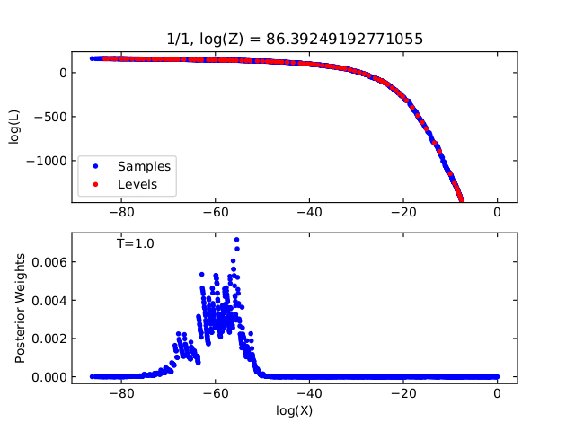
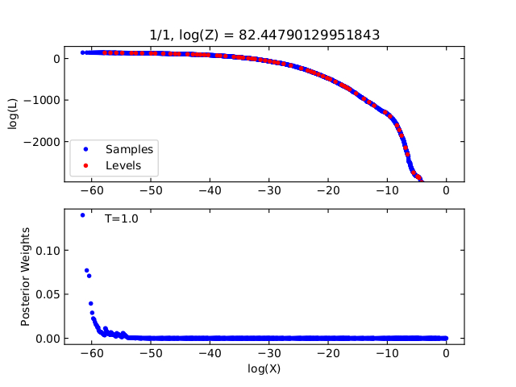

***************
Nested Sampling
***************
``brains`` employs the diffusive nested sampling algorithm developed by Brendon J. Brewer (https://github.com/eggplantbren/DNest3).
We write a C version of the algorithm, dubbed as ``CDNest``.  ``CDNest`` needs to input some options.

The format of option file for CDNest looks like as follows::

  # File containing parameters for CDNest
  # Put comments at the top, or at the end of the line.
  # Do not change the order of lines.
  # Lines beginning with '#' are regarded as comments.

  2     # Number of particles
  4000  # new level interval
  4000  # save interval
  800   # threadSteps - how many steps each thread should do independently before communication
  40    # maximum number of levels
  10    # Backtracking scale length (lambda in the paper Brewer et al. 2011)
  100   # Strength of effect to force histogram to equal push. 0-10 is best. (beta in the paper Brewer et al. 2011)
  200   # Maximum number of saves
  data/sample2d.txt                 # sample file
  data/sample_info2d.txt            # sample_info file
  data/levels2d.txt                 # level file
  data/sampler_state2d.txt          # sample state file
  data/posterior_sample2d.txt       # posterior sample file
  data/posterior_sample_info2d.txt  # posterior sample info file
  data/limits2d.txt                 # limits file

The option file for continuum reconstruction is ``OPTIONSCON``, for 1d RM is ``OPTIONS1D``, and 
for 2d RM is ``OPTIONS2D``. ``brains`` will automatically reads these options appropriately. 

One should not change the orders of lines. Lines beginning with '\#' are regarded as comments. 
There is not a general rule to set the values of options. The most important options are the options 
for new level interval and maximum number of levels. Sufficiently large values will work better, but also
will cause extra computation time. The option for maximum number of saves controls the length of the 
Markov chains. Note that this is not the length of the final posterior sample. 

To check whether the values of options are appropriate, one may run the python script ``postprocess.py``
in the subdirectory to inspect the log-likelihood-curve; see also the user mannual in the 
package DNest3 developed by Brendon J. Brewer, which is available at https://github.com/eggplantbren/DNest3. 

  
  Example for log-likelihood cruve of a good run with appropriate options.

  
  Example for log-likelihood cruve of a bad run with inappropriate options.