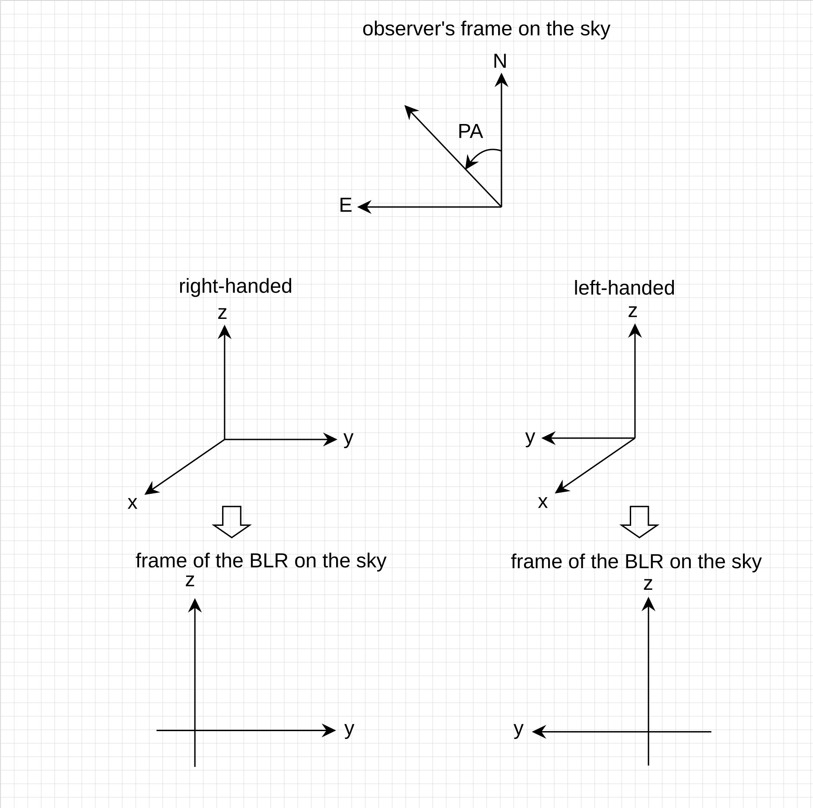
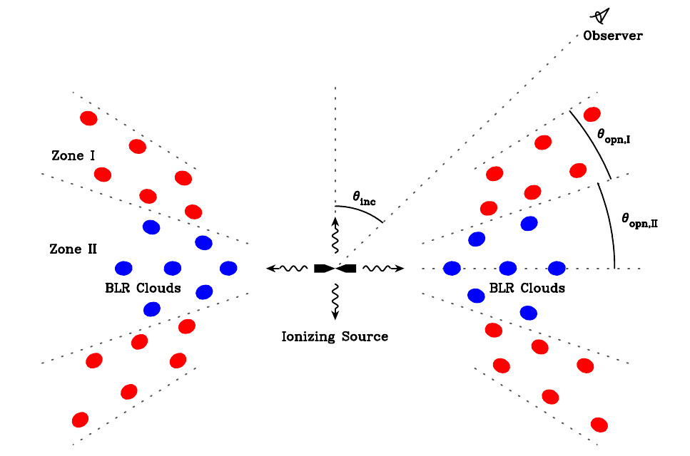
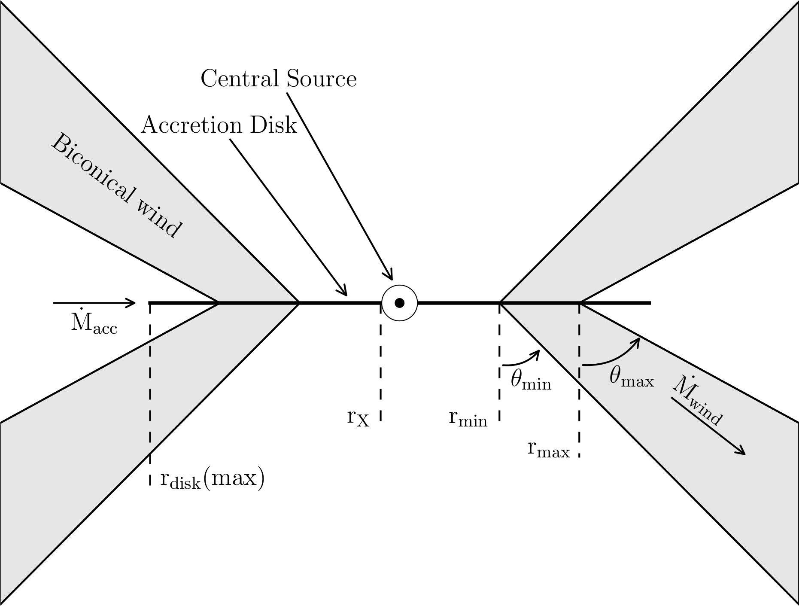

.. _model_label:

************************
BLR Models
************************

``brains`` already encapsulates several BLR dynamical models detailed below. To specify those models in 
running, edit the option "FlagBLRModel" in the parameter file (see :ref:`Parameter File`).

Broad-line regions are generally assumed to be composed of a larg number of 
point-like clouds. These clouds respond to the central ionizing continuum
and emit broad emission lines.

BLR coordinate and observer's coordinate
========================================
The BLR coordinate is adopted to be left-handed (see **Fig.1**). The x-axis is set to be along 
the line of sight and the positive x-axis points to the observer. That is to say,
a positive velocity in the BLR's coordinate corresponds to a blus-shift velocity
in observer's coordinate.

  **Fig.1** The coordinate frames. **X-axis is the along the line of sight and positive x-axis 
  points to the observer**. Left-handed coordinate of 
  the BLR is preferred, which is consistent with the coordinate frame of the observer. However, for 
  axisymmetric BLRs, the two types of coordinate frames are indistinguishable.

BLR model 1
===========
This model is from Brewer et al. (2011).
Clouds' distribution has a disk-like shape (see the figure) and is axis-symetric.

* **Radial distribution**: :math:`\Gamma`-distribution

  .. math::
  
    \Gamma(r|\alpha, \theta) = 
    \frac{1}{\Gamma(\alpha)\theta^{\alpha-1}}r^{\alpha-1}\exp\left(-\frac{r}{\theta}\right)

* **Dynamics**: clouds' orbital angular momentum and energy are randomly assigned following distributions

  .. math::

    E = \left(\frac{1}{1+\exp(-\chi)}\right)E_{\rm min},~~~
    E_{\rm min}=-\frac{GM_\bullet}{r}, ~~~\chi\sim N(0, \lambda^2)\\
    p(L)\sim \exp\left(-\frac{|L|}{\lambda L_{\rm max}}\right),~~~
    |L| < L_{\rm max} = \sqrt{2r^2\left(E+\frac{GM_\bullet}{r}\right)}

* **Emissivity**: anisotropic prescription

  .. math::
  
    w(\phi) = \frac{1}{2} + \kappa \cos\phi

  where :math:`\phi` is the angle between the observer's line of sight to the central ionizing 
  source and the cloud's line of sight to the central source.

.. figure:: _static/fig_blr_disk.jpg
  :align: center
  :width: 12 cm

  **Fig.2** Schematic of a disk-like broad-line region (Li et al. 2013).

BLR model 2
===========
The radial distribution and emissivity are the same as model 1. The **dyanmics** of clouds are 
modeled in the orbital plane as 

.. math::
  
  \rho_r \sim N(1, \sigma_r^2), ~~~~\rho_\theta \sim N(\pi/2, \sigma_\theta^2),\\
  V_r = V_{\rm circ}\rho_r\cos\rho_\theta,\\
  V_\theta = V_{\rm circ}\rho_r\sin\rho_\theta,

where :math:`V_{\rm circ}=\sqrt{GM_\bullet/r}` is the circular velocity.

BLR model 3
===========
* **Radial distribution**: power-law distribution

  .. math::
  
    \rho(r|\alpha) = \rho_0 \left(\frac{r}{r_0}\right)^{-\alpha},~~~~r_{\rm in} < r < r_{\rm out}

* **Dynamics**: Keplerian motion and inflow/outflow.

  .. math::

    \boldsymbol{v} = V_{\rm Kep}\boldsymbol{e_{\theta}} + \xi \sqrt{\frac{2GM_\bullet}{r}} \boldsymbol{e_{r}}

BLR model 4
===========
This model is the same as model 3, except for the **dynamics** 

.. math::
  
    \boldsymbol{v} = \sqrt{1-2\xi^2}V_{\rm Kep}\boldsymbol{e_{\theta}} + \xi \sqrt{\frac{2GM_\bullet}{r}} \boldsymbol{e_{r}}

BLR model 5
===========
* **Radial distribution**: double power-law distribution.

.. math::

  f(r) \propto \left\{\begin{array}{ll}
  r^{\alpha}, & {\rm for}~F_{\rm in}\leqslant r/R_0 \leqslant 1,\\
  r^{-\alpha},& {\rm for}~1\leqslant r/R_0 \leqslant F_{\rm out},
  \end{array}\right.

* The **dyanmics** and **emissivity** are the same as model 6.

BLR model 6
===========
This is compatible with Pancoast et al. (2014)'s model.

* **Radial distribution**: :math:`\Gamma`-distribution

  .. math::
  
    \Gamma(r|\alpha, \theta) = 
    \frac{1}{\Gamma(\alpha)\theta^{\alpha-1}}r^{\alpha-1}\exp\left(-\frac{r}{\theta}\right)

* **Dynamics**: A fraction :math:`f_{\rm ellip}` of clouds have bound elliptical Keplerian orbits and the remaining 
  fraction :math:`(1-f_{\rm ellip})` is either inflowing :math:`(0 < f_{\rm flow} < 0.5)` or outflowing 
  :math:`(0.5 < f_{\rm flow} < 1)`. 
  
  For elliptical orbits, the radial and tangential velocities are drawn 
  from Gaussian distributions centered around a point :math:`(v_r, v_\phi) = (0, v_{\rm circ})` 
  with standard deviations :math:`\sigma_{\rho,\rm circ}` and :math:`\sigma_{\Theta,\rm circ}`, respectively.
  Here, :math:`v_{\rm circ}=\sqrt{GM_\bullet/r}` is the local Keplerian velocity.

  For inflowing/outflowing clouds, velocities are drawn similarly from Gaussian distributions centered 
  around points :math:`(v_r, v_\phi) = (\pm \sqrt{2} v_{\rm circ}, 0)`` with standard deviations :math:`\sigma_{\rho,\rm rad}` 
  and :math:`\sigma_{\Theta,\rm rad}`, where “+” corresponds to outflows and “−” corresponds to inflows.

* **Emissivity**: anisotropic prescription

  .. math::
  
    w(\phi) = \frac{1}{2} + \kappa \cos\phi

  where :math:`\phi` is the angle between the observer's line of sight to the central ionizing 
  source and the cloud's line of sight to the central source.

BLR model 7
===========
This is the shadowed model in Li et al. (2018).

  **Fig.3** Schematic of a disk-like broad-line region with two zones (Li et al. 2018).

BLR model 8
===========
A disk wind model from Shlosman & Vitello (1993).

  **Fig.4** Schematic of a disk wind model (figure credit: Higginbottom et al. 2013).

In the cylindrical coordinate, the wind stream line have an angle as 

.. math::
  \theta = \theta_{\rm min} + (\theta_{\rm max}-\theta_{\rm min})x^\gamma,\\
  x=(r_0-r_{\rm min})/(r_{\rm max}-r_{\rm min}),

where :math:`r_0` is the root point of the stream line. The velocity along the stream line 
is 

.. math::
  v_l = v_0 + (v_\infty-v_0)\frac{(l/R_v)^\alpha}{1 + (l/R_v)^\alpha},

where :math:`l` is the distance along the stream line, :math:`R_v` is the scale length, 
:math:`v_0` is the initial velocity, and :math:`v_\infty` is the terminal velocity defined 
to be 

.. math::
  v_\infty = \sqrt{\frac{2GM_\bullet}{r_0}}.

The velocity components are 

.. math::
  v_r = v_l \sin\theta, ~~~ v_z = v_l \cos\theta.

The azimuthal velocity is given by assuming conservations of the angular momentum

.. math::
  v_\phi = v_{\phi, 0}\left(\frac{r_0}{r}\right) = \frac{\sqrt{GM_\bullet r_0}}{r}.

The density along the stream line is given by 

.. math::
  \rho(l) = \frac{\dot m}{v_l} \frac{r_0 dr_0}{rdr},

where :math:`\dot m` is the mass-loss rate at the root of the stream line.

BLR model 9
===========
This is the model adopted in the spectroastrometric modeling on 3C 273 by GRAVITY Collaboration (2018).

* **Radial distribution**: :math:`\Gamma`-distribution

  .. math::
  
    \Gamma(r|\alpha, \theta) = 
    \frac{1}{\Gamma(\alpha)\theta^{\alpha-1}}r^{\alpha-1}\exp\left(-\frac{r}{\theta}\right)

* **Dynamics**: circular Keplerian motion,

  .. math::

    V_{\rm Kep} = \sqrt{\frac{GM}{r}}.

* **Emissivity**: isotropic prescription.

References
==========
* Brewer, B. et al. 2011, ApJL, 733, 33

* GRAVITY Collaboration et al. 2018, Nature, 563, 657
  
* Higginbottom, N. et al. 2013, MNRAS, 436, 1390

* Li, Y.-R. et al. 2013, ApJ, 779, 110

* Li, Y.-R. et al. 2018, ApJ, 869, 137

* Pancoast, A. et al. 2014, MNRAS, 445, 3055

* Shlosman I., Vitello P., 1993, ApJ, 409, 372