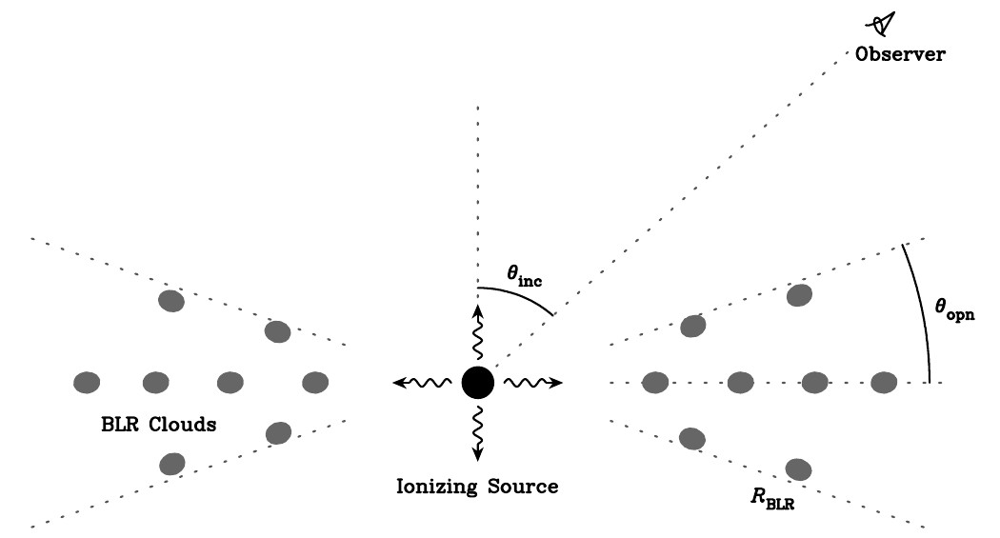

************************
Broad-line region models
************************

``brains`` already encapsulate several BLR dynamical models detailed below. To specify those models in 
running, edit the option "FlagBLRModel" in the parameter file.

  Schematic of a disk-like broad-line region.

BLR model 1
===========

BLR model 2
===========

BLR model 3
===========

BLR model 4
===========

BLR model 5
===========

BLR model 6
===========
This is compatible with Pancoast et al. (2014)'s model.

BLR model 7
===========
This is the shadowed model in Li et al. (2018).

.. figure:: _static/fig_blr_twozone.jpg
  :align: center 

  Schematic of a disk-like broad-line region with two zones.

