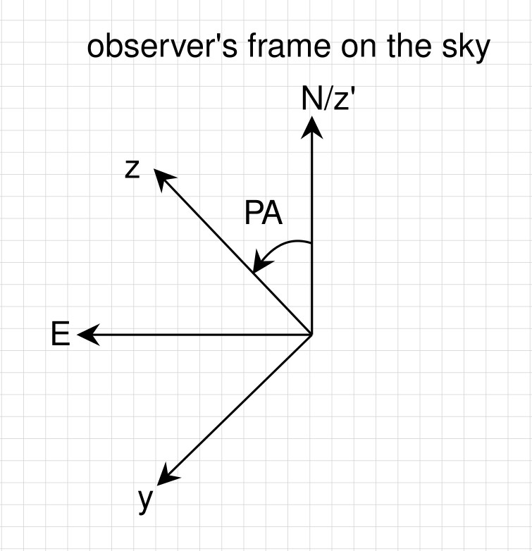

****************************
Spectro-astrometric Analysis
****************************

With a given dynamical BLR model, it is easy to calculate its spectro-astrometric signals.
Let us denote the projected coordinates of BLR clouds on the sky as :math:`(\alpha, \beta)`,
then spectro-astrometry :math:`s_\lambda` along a direction :math:`(u_\alpha, u_\beta)` 
(e.g., spectral slit or interferometric baseline) is

.. math::
  
  s_\lambda =  \frac{f_\lambda}{1+f_\lambda} (u_\alpha \times \alpha + u_\beta\times \beta),

where :math:`\lambda` is wavelength, :math:`f_\lambda` is the line flux ratio relative to the 
underlying continuum flux. 

For spectro-inteferometry, the measured quantity is differential phase :math:`\phi` (in 
degree),
which is realted to astrometry as 

.. math::
  
  \phi_\lambda = -2\pi \frac{B}{\lambda}s_\lambda,

where :math:`B` is the sky-projected length of the baseline.

To compute the sky-projected position of BLR clouds, there involves a quantity called 
position angle :math:`PA` of the BLR symmetry axis. If we create a **left-handed** Cartesian coordinate frame for 
BLR clouds, in which the :math:`x`-axis is along the line of sight and positive x-axis points to 
the observer (see :ref:`model_label`), then the sky-projected position of a BLR cloud with coordinates :math:`(x, y, z)` is

.. math::

  \alpha &=&\,\,\,\, y\times \cos(PA) + z \times \sin(PA),\\
  \beta &=& -y \times \sin(PA) + z \times \cos(PA).\\

``brains`` read input spectro-astrometric data and fit :math:`f_\lambda` and :math:`s_\lambda`
to constrain the model parameters. 

  **Fig.1** Rotation of the BLR coordinate (YOZ) with a position angle (PA) to the observer's 
  coordinate on the sky (Y'OZ'/EON).

